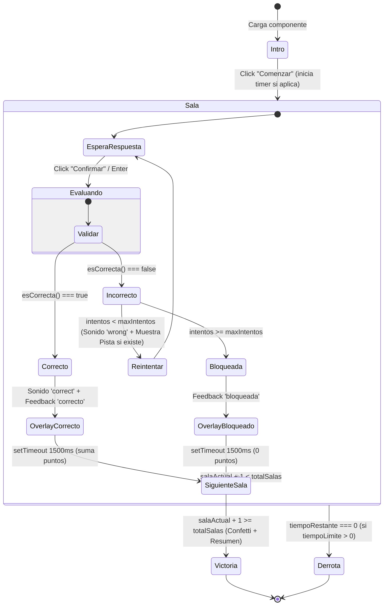

# Peritaje Exhaustivo — Escape Room (Pre-Fase 5: Escape Room 2.0)

> **Fecha de peritaje:** 26 de agosto de 2026  
> **Alcance:** Diagnóstico integral de la arquitectura, modelos, persistencia, sockets, componentes frontend y flujos de Escape Room en `lumina-backend` y `lumina-frontend`.  
> **Propósito:** Diagnóstico técnico de línea base previo a la implementación de **Fase 5 (Escape Room 2.0)** del Roadmap Detallado.  
> **Regla de oro:** Documento exclusivamente analítico. No modifica código ni redefine esquemas definitivos.  

---

## 1. Inventario de modelos y esquema (Prisma & JSON Schema)

### 1.1 Existencia en Prisma (`lumina-backend/prisma/schema.prisma`)

En la base de datos relacional de PostgreSQL **no existen tablas dedicadas** a Escape Room (`EscapeRoom`, `EscapeRoomSala`, `EscapeRoomTeam`, `EscapeRoomProgress`, `EscapeRoomHint`, etc.).

La persistencia de un Escape Room reside íntegramente serializada dentro del campo `Slide.content` (tipo `Json?`) como un bloque de actividad:

```prisma
// lumina-backend/prisma/schema.prisma (L206-L218)
model Slide {
  id        String         @id @default(cuid())
  order     Int
  type      SlideType      // COVER | CONTENT | ACTIVITY | VIDEO | IMAGE
  title     String
  content   Json?          // <-- Aquí reside EscapeRoomActivity dentro de bloques[]
  classId   String
  createdAt DateTime       @default(now())
  class     Class          @relation(fields: [classId], references: [id], onDelete: Cascade)
  versions  SlideVersion[]
  @@map("slides")
}
```

### 1.2 Estructura JSON actual (`lumina-frontend/src/types/slide.types.ts`)

Los tipos TypeScript que gobiernan el JSON persistido en `Slide.content` son:

#### `EscapeRoomActivity` (L291–L301)
| Campo | Tipo | Obligatorio | Valor por Defecto | Estado / Uso Real |
|---|---|:---:|---|---|
| `tipo` | `'escape_room'` | Sí | `'escape_room'` | En uso real (discriminador de actividad). |
| `titulo` | `string` | Sí | `''` (o `'Escape Room'` en fallback) | En uso real (header intro / editor). |
| `introduccion` | `string` | Sí | `''` | En uso real (narrativa inicial). |
| `salas` | `EscapeRoomSala[]` | Sí | `[...salasFallback]` (mínimo 1) | En uso real (colección de habitaciones). |
| `tiempoLimiteMinutos` | `number` | No | `undefined` (0 = sin límite) | En uso real (contador regresivo). Rango en UI: 0 a 60 min. |
| `mostrarRanking` | `boolean` | Sí | `true` | **Vestigial / Parcial**: Configurable en editor, pero `EscapeRoomViewer` no renderiza tabla de ranking global ni leaderboard al cierre. |
| `puntosBase` | `number` | Sí | `300` | En uso real (base para cálculo de puntos por sala según intento). |

#### `EscapeRoomSala` (L272–L289)
| Campo | Tipo | Obligatorio | Valor por Defecto | Estado / Uso Real |
|---|---|:---:|---|---|
| `id` | `string` | Sí | `uid()` / `cuid` | En uso real (identificador de sala, key en dnd-kit y tracking). |
| `nombre` | `string` | Sí | `'Nueva sala'` | En uso real (título en editor y en viewer durante el juego y victoria). |
| `descripcion` | `string` | Sí | `''` | En uso real (texto de contexto narrativo). |
| `desafio` | `string` | Sí | `''` | En uso real (pregunta o acertijo). |
| `tipoRespuesta` | `'texto' \| 'opcion_multiple' \| 'codigo'` | Sí | `'texto'` | En uso real (determina componente de input). |
| `opciones` | `string[]` | No | `['', '']` (solo si `opcion_multiple`) | En uso real para `'opcion_multiple'`. |
| `respuestaCorrecta` | `string` | Sí | `''` | En uso real (patrón de validación). |
| `ignorarMayusculas` | `boolean` | Sí | `true` | En uso real (comparación `.toLowerCase()` en texto/código). |
| `pista` | `string` | No | `undefined` | **Parcial**: Campo único `string` (no array). En uso en viewer tras 1er fallo. |
| `intentosMaximos` | `number` | Sí | `3` (valores: `1`, `2`, `3`, `-1` = ilimitado) | En uso real (bloquea la sala al agotarse). |
| `bloques` | `Block[]` | No | `undefined` | **En desarrollo / Vestigial en runtime**: Diseñado para el editor 2.0 (`/classes/[id]/escape-room`), pero el `EscapeRoomViewer` actual **no renderiza los bloques visuales del canvas**, solo muestra el formulario clásico. |
| `fondo` | `Background` | No | `undefined` | **En desarrollo / Vestigial en runtime**: Configurable en canvas de sala pero ignorado por `EscapeRoomViewer`. |

### 1.3 Relaciones ambiguas y evaluación de duplicidades

1. **Jerarquía y propiedad del Escape Room:**
   - Un Escape Room es simplemente un bloque `ActivityBlock` (`b.tipo === 'actividad' && b.actividad.tipo === 'escape_room'`) dentro de un `Slide`.
   - En el editor principal (`/classes/[id]/editor`), un slide puede contener un bloque Escape Room o varios bloques mixtos.
   - En la ruta dedicada `/classes/[id]/escape-room`, la función [`findEscapeRoomSlide`](file:///c:/Users/Jaime/proyectos/lumina/lumina-frontend/src/app/(app)/classes/[id]/escape-room/escape-room-designer-client.tsx#L62-L84) busca el **primer slide** que tenga una actividad `escape_room`. Si una clase tuviera múltiples slides con Escape Room, la ruta dedicada ignora los subsiguientes.
2. **Sub-canvases anidados dentro de una sola entidad:**
   - Cada `EscapeRoomSala` tiene sus propios `bloques?: Block[]` y `fondo?: Background`. Esto significa que un solo `Slide` puede contener un árbol JSON masivo con decenas de sub-diapositivas completas serializadas dentro de un array.
3. **Existencia previa de tablas de equipos/grupos:**
   - En `schema.prisma` existen los modelos `WorkGroup` (L637) y `WorkGroupMember` (L651). Sin embargo, pertenecen al subsistema de cursos/colaboración académica para tareas grupales del LMS (`Course -> WorkGroup -> Activity`), sin ninguna vinculación con sesiones en tiempo real (`ClassSession` / `LiveSessionsGateway`).
   - No existen tablas ni estructuras parciales para equipos de sesión en vivo, tracking de candados de equipo ni historial de pistas solicitadas.

---

## 2. Flujo actual de habitaciones/salas

### 2.1 Desbloqueo y ciclo de vida paso a paso (Viewer)

El ciclo de ejecución en [`escape-room-viewer.tsx`](file:///c:/Users/Jaime/proyectos/lumina/lumina-frontend/src/components/viewers/escape-room-viewer.tsx) opera como una máquina de estados local en React (`useState<Phase>('intro' | 'sala' | 'victoria' | 'derrota')`):



#### Paso a paso detallado:
1. **Fase Intro:** Presenta título, narrativa general, número total de salas y badge de tiempo límite.
2. **Inicio:** Al presionar "Comenzar", se fija `tiempoInicioRef.current = Date.now()`, se pasa a fase `'sala'` con `salaActual = 0`, y si `tiempoLimiteMinutos > 0`, se activa un `setInterval` de 1 segundo.
3. **Validación de respuesta:**
   - Si `tipoRespuesta === 'opcion_multiple'`: Compara `selectedOption === sala.respuestaCorrecta`.
   - Si `tipoRespuesta === 'texto' | 'codigo'`: Ejecuta [`esCorrecta`](file:///c:/Users/Jaime/proyectos/lumina/lumina-frontend/src/components/viewers/escape-room-viewer.tsx#L39-L46). Si `ignorarMayusculas === true`, hace `trim().toLowerCase() === trim().toLowerCase()`.
4. **Condición de avance y scoring:**
   - **Acierto:** Asigna puntos según el intento ([`calcularPuntos`](file:///c:/Users/Jaime/proyectos/lumina/lumina-frontend/src/components/viewers/escape-room-viewer.tsx#L48-L52): intento 1 = `puntosBase` [100%]; intento 2 = 50%; intento 3+ = ~17%). Emite `onAnswer(sala.id, respuesta, true, intentoActual)`. Muestra overlay verde por 1500 ms y pasa a `salaActual + 1`.
   - **Fallo con intentos restantes:** Incrementa `intentos`, emite `onAnswer(sala.id, respuesta, false, intentoActual)`, reproduce sonido `wrong`, y si `sala.pista` existe, habilita el botón "Ver pista".
   - **Fallo agotando intentos:** Si `intentos >= sala.intentosMaximos` (cuando `intentosMaximos !== -1`), marca la sala como `'bloqueada'`, asigna **0 puntos**, muestra overlay rojo de bloqueo durante 1500 ms y **avanza forzosamente a la siguiente sala**.
5. **Cierre:**
   - Si se supera la última sala: Pasa a fase `'victoria'`, detiene timer, dispara confetti CSS y muestra desglose por sala.
   - Si el timer llega a 0: Pasa a fase `'derrota'`, detiene timer y muestra salas completadas hasta ese momento.

### 2.2 Unidad de progreso: Individual vs. Sesión vs. Equipo

- **Progreso 100% local en cliente:** El progreso vive en el estado efímero del componente (`useState`). Si el estudiante refresca la página (F5) o se reconecta, **el progreso se reinicia a la Sala 1 en fase Intro**.
- **Sin noción de equipo:** No existe ninguna estructura de estado compartida entre múltiples estudiantes para resolver salas cooperativamente.
- **Incompatibilidad directa con Fase 5:** El requisito de Fase 5 de "Progreso por equipo" requiere que el estado de la sala (sala actual desbloqueada, candados abiertos, intentos consumidos, pistas reveladas) esté centralizado en backend o sincronizado vía Socket.IO por `teamId`.

### 2.3 Acoplamiento con el motor de Evaluación autónoma (`activity-scoring`)

#### Estado actual en `activity-scoring.ts`:
- Tanto en `lumina-backend/src/classes/activity-scoring.ts` (L94) como en `lumina-frontend/src/lib/activity-scoring.ts` (L95):
  ```ts
  escape_room: 'exclude', // Nunca entra al promedio académico
  ```
- [`esEvaluable('escape_room')`](file:///c:/Users/Jaime/proyectos/lumina/lumina-backend/src/classes/activity-scoring.ts#L107-L110) retorna `false`.
- [`evaluateActivityResponse('escape_room', ...)`](file:///c:/Users/Jaime/proyectos/lumina/lumina-backend/src/classes/activity-scoring.ts#L940-L961) retorna `UNEVALUABLE` (`{ score: null, correct: null, details: [] }`).

#### Deuda y acoplamientos anómalos detectados:
1. **Filtrado incompleto en persistencia en vivo:**
   - En [`classes.service.ts` (L690)](file:///c:/Users/Jaime/proyectos/lumina/lumina-backend/src/classes/classes.service.ts#L690), el método `upsertLiveStudentResponse` tiene un bypass explícito para Torneo: `if (activityType === 'torneo') return;`.
   - **Escape Room no está excluido.** Por tanto, cada vez que un estudiante responde una sala, `upsertLiveStudentResponse` busca la sesión y crea/actualiza un registro en `ClassResult` con `score: null, correct: null`. Esto ensucia la tabla `class_results` con registros nulos.
2. **Pérdida de metadatos en puente `SlideRenderer`:**
   - En [`slide-renderer.tsx` (L1000)](file:///c:/Users/Jaime/proyectos/lumina/lumina-frontend/src/app/(app)/classes/[id]/editor/components/slide-renderer.tsx#L1000):
     ```tsx
     onAnswer={(roomId, answer) => onResponse?.({ roomId, answer })}
     ```
     `EscapeRoomViewer` pasa `(salaId, answer, correct, intento)`, pero `slide-renderer` descarta `correct` e `intento` y solo pasa `{ roomId, answer }`.
   - Además, `onComplete={undefined}` está cableado como `undefined`, por lo que el evento de victoria/derrota nunca notifica al contenedor padre.
3. **Ejecución innecesaria de `evaluateActivityResponse` en viewers:**
   - En [`viewer-client.tsx` (L370)](file:///c:/Users/Jaime/proyectos/lumina/lumina-frontend/src/app/(app)/classes/[id]/viewer/viewer-client.tsx#L370) y [`autonomo-client.tsx` (L500)](file:///c:/Users/Jaime/proyectos/lumina/lumina-frontend/src/app/autonomo/[sessionId]/autonomo-client.tsx#L500), el callback `handleResponse` corre `evaluateActivityResponse` para todas las actividades indistintamente.

---

## 3. Capa de tiempo real (Socket.IO)

### 3.1 Eventos existentes en Backend y Frontend

Actualmente existen dos gateways Socket.IO en el backend:

#### A. `ClassesGateway` (`/` namespace por defecto — `lumina-backend/src/classes/classes.gateway.ts`)
| Evento | Dirección | Room / Canal | Payload | Propósito |
|---|---|---|---|---|
| `join-class` | Cliente → Servidor | `class-${classId}` | `{ classId: string }` | Unirse a la sala de la clase. |
| `slide-change` | Cliente ↔ Servidor | `class-${classId}` | `{ slideIndex: number, classId: string }` | Sincronizar slide activo controlado por docente. |
| `student-progress` | Estudiante → Servidor → Docente | `class-${classId}` | `{ classId, studentId, slideIndex }` | Notificar slide actual en modo autónomo. |
| `student-response` | Estudiante → Servidor | `class-${classId}` | `{ classId, slideId, slideIndex, activityType, studentId, studentName, correct, response }` | Envía respuesta de actividad; retransmite `response-update` al docente y hace upsert en BD. |
| `response-update` | Servidor → Docente | `class-${classId}` | Mismo payload de `student-response` | Feed en vivo para el panel docente. |
| `activity:complete` | Estudiante → Servidor | `class-${classId}` | `{ sessionId, classId, studentId, nombre, score, correct }` | Registra XP/badges en gamificación y emite `gamification:update`. |

#### B. `LiveSessionsGateway` (`/live` namespace — `lumina-backend/src/live-sessions/live-sessions.gateway.ts`)
| Evento | Dirección | Room / Canal | Payload | Propósito |
|---|---|---|---|---|
| `session:start` / `session:end` | Docente ↔ Servidor | `live:${classId}` | `{ classId }` | Control de sesión sincrónica. |
| `join` / `leave` | Cliente ↔ Servidor | `live:${classId}` | `{ classId }` | Handshake autenticado de sesión en vivo. |
| `slide:sync` / `slide:current` | Docente ↔ Servidor | `live:${classId}` | `{ classId, slideId, order }` | Sincronización estricta de slide. |
| `torneo:*` (`init`, `launch-question`, `answer`, `finish`, `ranking`, `end`) | Cliente ↔ Servidor | `live:${classId}` y `class-${classId}` | Payloads dedicados de Torneo | Motor en tiempo real de Torneo / Gamificación sincrónica. |

### 3.2 Evaluación de extensibilidad para `room-unlocked` y `team-progress`

- **Patrón de referencia disponible:** El subsistema `Torneo` dentro de `LiveSessionsGateway` y `ClassesGateway` demuestra exactamente cómo Lumina maneja actividades complejas en tiempo real (módulo de servicio dedicado `torneo.service.ts` + endpoints/eventos específicos + puente dual a `live:${classId}` y `class-${classId}`).
- **Evaluación:** El patrón actual **no requiere un refactor mayor del gateway base**. Puede extenderse limpiamente añadiendo un servicio `EscapeRoomService` / sub-gateway con los eventos solicitados en Fase 5:
  - `escape-room:join-team` / `escape-room:team-assigned`
  - `escape-room:room-unlocked` (notifica desbloqueo de sala a todos los miembros del equipo y al panel docente)
  - `escape-room:team-progress` (telemetría de salas superadas, intentos y tiempo)
  - `escape-room:hint-request` (descuenta puntos o notifica solicitud de pista al equipo)

### 3.3 Manejo de reconexión

- **Estado actual:** **Inexistente para Escape Room.**
- Si un estudiante pierde la conexión WebSocket o recarga la pestaña:
  1. El cliente Socket.IO se reconecta y re-emite `join-class` / `join`.
  2. Pero `EscapeRoomViewer` se remonta con estado inicial: `phase = 'intro'`, `salaActual = 0`, `puntosAcumulados = 0`, `historial = []`.
  3. No existe ningún evento tipo `escape-room:state` o `get-team-state` para recuperar la sala donde iba el equipo.

---

## 4. Frontend — Componentes actuales

### 4.1 Inventario de componentes

| Componente | Archivo | Responsabilidad Actual | Patrón Single Write Path | Estado de Salud |
|---|---|---|:---:|---|
| `EscapeRoomEditor` | `src/components/editor/activities/escape-room-editor.tsx` | Editor en acordeón / dnd-kit de salas para el panel lateral de actividades del editor principal. | ✅ Sí (`onChange` normalizado) | **Funcional**. Bien tipado, drag and drop con sensor protegido contra inputs. |
| `EscapeRoomSalaConfigFields` | `src/components/editor/activities/escape-room-editor.tsx` | Formulario reutilizable de propiedades de una sala (nombre, narrativa, desafío, tipo de respuesta, pista, intentos). | ✅ Sí (`onUpdate(patch)`) | **Funcional**. Compartido entre editor principal y editor pantalla completa. |
| `EscapeRoomActivityEditor` | `src/app/(app)/classes/[id]/editor/components/activities/escape-room-activity.tsx` | Contenedor del editor dentro del lienzo del slide editor. Usa `useActivityEditor` (debounce + flush). | ✅ Sí (`schedulePersist`) | **Funcional** (tiene botón "Diseñar Escape Room" deshabilitado con badge "Próximamente"). |
| `EscapeRoomDesignerClient` | `src/app/(app)/classes/[id]/escape-room/escape-room-designer-client.tsx` | Editor dedicado de 3 columnas (`/classes/[id]/escape-room`): lista de salas a la izquierda, canvas visual al centro, propiedades lógicas a la derecha. | ⚠️ Parcial (persistencia manual con botón "Guardar" y Ctrl+S a nivel de slide). | **Funcional como prototipo** (marcado con banner "Editor en desarrollo — Próximamente"). |
| `EscapeRoomSalaCanvas` | `src/app/(app)/classes/[id]/escape-room/escape-room-sala-canvas.tsx` | Canvas interactivo para colocar bloques visuales y fondo dentro de cada sala usando `SlideRenderer` y `useBlockDrag`. | ✅ Sí (`onChange({ bloques, fondo })`) | **Funcional en diseño visual**, pero desconectado del reproductor del estudiante. |
| `EscapeRoomViewer` | `src/components/viewers/escape-room-viewer.tsx` | Reproductor interactivo del juego (Intro → Sala → Victoria/Derrota). | N/A (componente de consumo) | **Funcional individualmente**, pero desconectado de sockets, sin persistencia de reconexión y con render puramente estático (no renderiza el canvas visual de la sala). |
| `LiveResponsesPanel` | `src/app/(app)/classes/[id]/editor/components/panels/live-responses-panel.tsx` | Panel docente en vivo. | N/A | **Sin soporte para Escape Room**. Muestra respuestas genéricas sin cuadrícula de equipos ni salas. |

### 4.2 Agrupación de estudiantes en equipos existente en la plataforma

Se realizó una búsqueda exhaustiva en frontend y backend sobre mecanismos de formación de equipos:
1. **LMS / Cursos (`WorkGroup`):** Solo existe para asignaciones asincrónicas de curso (`/courses/[id]/groups`). No tiene integración con sockets ni con participantes anónimos/guests de una clase.
2. **Ruleta (`ruleta-defaults.ts`):** Tiene opciones predeterminadas "Equipo 1", "Equipo 2", pero es puramente cosmético dentro de la ruleta.
3. **Conclusión:** **No existe ningún mecanismo de agrupación de estudiantes en equipos en tiempo real para sesiones de clase.** Debe crearse como parte de Fase 5 (asignación automática o manual de estudiantes a equipos en la sesión en vivo).

---

## 5. Pistas, intentos y condiciones de cierre

### 5.1 Sistema actual de pistas (Hints)
- **Definición de datos:** Campo opcional único `pista?: string` en `EscapeRoomSala`.
- **Editor:** Un único `textarea` rotulado *"Pista (opcional)"*.
- **Comportamiento en Viewer:**
  - Si `sala.pista` está definido y no está vacío, el botón *"Ver pista"* permanece oculto al entrar a la sala.
  - Se hace visible **únicamente tras el primer intento fallido** (`intentos >= 1 && feedback !== 'correcto'`).
  - Al hacer clic, el botón cambia a un contenedor con fondo ámbar (`bg-[#fef3c7]`) mostrando el texto de la pista.
  - **No hay penalización de puntos** por ver la pista.
  - **No hay soporte para múltiples pistas secuenciales** (ej. Pista 1 tras fallo 1, Pista 2 tras fallo 2).

### 5.2 Sistema actual de intentos máximos
- **Definición de datos:** Campo `intentosMaximos: number` en `EscapeRoomSala`.
- **Editor:** Un `<select>` con opciones fijas: `1`, `2`, `3`, `-1` (ilimitado).
- **Comportamiento en Viewer:**
  - Fallo con intentos disponibles: Muestra mensaje *"Incorrecto. Te quedan N intentos."* y permite seguir probando.
  - Agotamiento de intentos (`intentos >= intentosMaximos`): Muestra overlay *"Sala bloqueada. Continuando de todas formas…"*, asigna 0 puntos a la sala y avanza a la siguiente sala tras 1.5s.
  - Si `intentosMaximos === -1`: No bloquea nunca, solo muestra *"Respuesta incorrecta."*.

### 5.3 Pantallas de cierre y victoria
- **Victoria:**
  - Se activa cuando `salaActual + 1 >= totalSalas`.
  - Elementos visuales: Icono de trofeo ámbar (`Trophy`), animación CSS de lluvia de confetti (`Confetti`), contador total de puntos y tiempo empleado (`formatMs`).
  - Desglose por sala: Lista con el nombre de cada sala, número de intentos utilizados y puntos obtenidos.
  - **Ausencias:** No hay botón para reiniciar/salir, no emite evento de finalización al socket, no muestra tabla comparativa con otros equipos ni ranking.
- **Derrota:**
  - Se activa cuando el tiempo límite llega a `00:00`.
  - Muestra icono de reloj rojo, total de salas completadas sobre el total, y puntos acumulados hasta la derrota.

---

## 6. Deuda técnica y riesgos identificados

### 6.1 Catálogo de deuda técnica

| ID | Deuda Técnica / Riesgo | Ubicación | Severidad | Bloquea Punto de Fase 5 |
|---|---|---|:---:|:---:|
| **DT-ER-01** | **Progreso volátil no hidratado:** El avance no se almacena en backend ni en sesión; una recarga reinicia el Escape Room. | `escape-room-viewer.tsx` (L171-L183) | Alta | Bloquea **Punto 1 (Flujo)** y **Punto 3 (Equipos)** |
| **DT-ER-02** | **Desconexión del Canvas visual en el Viewer:** El editor permite diseñar bloques visuales por sala (`bloques?: Block[]`), pero el viewer del estudiante solo renderiza la tarjeta de texto tradicional. | `escape-room-viewer.tsx` vs `escape-room-sala-canvas.tsx` | Media | Bloquea **Punto 1 (Rediseño de flujo)** |
| **DT-ER-03** | **Persistencia errónea en `ClassResult`:** `upsertLiveStudentResponse` no filtra `escape_room` (a diferencia de `torneo`), guardando filas con `score: null` en la base de datos. | `classes.service.ts` (L690) | Media | No bloquea, pero es deuda crítica de base de datos |
| **DT-ER-04** | **Pistas en formato escalar (`string`) en vez de array (`string[]`):** El schema actual solo permite una pista por sala. | `slide.types.ts` (L283) | Baja | Bloquea **Punto 2 (Pistas progresivas)** |
| **DT-ER-05** | **Falta de canalización de sockets en `EscapeRoomViewer`:** Props `liveSocket`, `studentId`, `classId` están prefijadas con guion bajo (`_liveSocket`, etc.) y sin usar en el cuerpo del viewer. | `escape-room-viewer.tsx` (L152-L156) | Alta | Bloquea **Punto 3 (Equipos)** y **Punto 4 (Dashboard Docente)** |
| **DT-ER-06** | **`onComplete` deshabilitado en `SlideRenderer`:** `slide-renderer.tsx` pasa `onComplete={undefined}` al `EscapeRoomViewer`. | `slide-renderer.tsx` (L999) | Media | Bloquea **Punto 6 (Pantalla de victoria/cierre)** |
| **DT-ER-07** | **Inexistencia de motor de equipos para sesiones en vivo:** No hay tablas, servicios ni sockets para formar equipos durante una clase sincrónica. | Stack completo | Alta | Bloquea **Punto 3 (Modo por equipos)** y **Punto 4 (Dashboard)** |
| **DT-ER-08** | **Desincronización entre editor de slide y editor dedicado `/escape-room`:** El editor dedicado manipula el slide mediante `updateSlide.mutate`, requiriendo guardar manualmente, mientras que el editor principal usa auto-persist con debounce. | `escape-room-designer-client.tsx` (L267) | Media | Afecta usabilidad del docente |

---

## 7. Matriz de impacto por punto de Fase 5

A continuación se detalla la base técnica existente, modificaciones requeridas, nuevos desarrollos y nivel de riesgo para cada uno de los 6 puntos estipulados en el roadmap de Fase 5:

| # | Punto de Fase 5 | Qué existe hoy (Base) | Qué debe modificarse | Qué debe crearse desde cero | Nivel de Riesgo | Justificación del Riesgo |
|---|---|---|---|---|:---:|---|
| **1** | **Rediseño completo del flujo de habitaciones/salas** | • Máquina de estados intro/sala/victoria/derrota.<br>• Editor de salas con dnd-kit.<br>• `normalizeEscapeRoomActivity` y `normalizeSala`.<br>• Canvas de sala visual (`EscapeRoomSalaCanvas`). | • `EscapeRoomViewer`: Integrar renderizado del canvas visual de la sala además de la caja de acertijo.<br>• `SlideRenderer`: Enlazar props completas de sync y callbacks.<br>• Lógica de desbloqueo sincronizada con backend. | • Hook de sincronización de estado de sala (`useEscapeRoomSession`).<br>• Capa de hidratación de progreso de sala. | **Medio** | Requiere mantener compatibilidad con slides legacy que solo tienen texto y no bloques visuales. |
| **2** | **Sistema de pistas (hints) configurable por sala** | • Campo `pista?: string` en `EscapeRoomSala`.<br>• UI básica de revelación tras 1er fallo.<br>• Textarea en `EscapeRoomSalaConfigFields`. | • Migrar tipo `pista?: string` → `pistas?: string[]` con migración retrocompatible en `normalizeSala`.<br>• `EscapeRoomSalaConfigFields`: Lista dinámica de pistas ordenadas.<br>• `EscapeRoomViewer`: Revelado progresivo (Pista 1, Pista 2...) con penalización o cooldown configurable. | • Componente `HintAccordion` / `HintButton` con telemetría de pistas vistas. | **Bajo** | Cambio autocontenido; `normalizeSala` puede transformar `pista: "abc"` en `pistas: ["abc"]` transparentemente. |
| **3** | **Modo por equipos (progreso independiente por equipo)** | • `WorkGroup` en BD (solo referencia conceptual LMS).<br>• `studentName` / `guestIdentity` en viewers. | • `EscapeRoomViewer`: Escuchar eventos de equipo para avanzar sala cuando cualquier miembro acierte.<br>• Sincronización de inputs y bloqueos a nivel de equipo. | • Modelo/Estructura de `EscapeRoomTeam` (en memoria o Redis/Prisma para sesión en vivo).<br>• Mecanismo de asignación/elección de equipo en fase Intro.<br>• Eventos Socket.IO: `team-joined`, `team-sync`. | **Alto** | Introduce estado distribuido multi-cliente; riesgo de condiciones de carrera si dos miembros del equipo responden simultáneamente. |
| **4** | **Dashboard del docente en tiempo real** | • `LiveResponsesPanel` en editor docente.<br>• Gateways Socket.IO existentes (`ClassesGateway` y `LiveSessionsGateway`). | • `LiveResponsesPanel`: Agregar vista especializada cuando la actividad activa sea `escape_room`.<br>• `classes.service.ts`: Excluir `escape_room` de `upsertLiveStudentResponse` para no saturar `ClassResult`. | • Componente `EscapeRoomLiveDashboard` (matriz de equipos vs salas, candados abiertos, tiempo, pistas usadas).<br>• Handlers Socket.IO en backend para `room-unlocked` y `team-progress`. | **Medio** | La infraestructura de WebSockets ya existe; el riesgo es aislar el tráfico de escape room sin impactar las demás actividades en vivo. |
| **5** | **Intentos máximos configurables por sala** | • Campo `intentosMaximos: number` en `EscapeRoomSala`.<br>• Lógica de bloqueo tras agotar intentos en `EscapeRoomViewer`.<br>• Select 1, 2, 3, ilimitado en editor. | • `EscapeRoomSalaConfigFields`: Input numérico flexible (o selector expandido) que permita cualquier número entero positivo o ilimitado (`-1`).<br>• `EscapeRoomViewer`: Mejorar la retroalimentación visual del bloqueo y la política de penalización. | • Política configurable de sala bloqueada (ej. avanzar con 0 puntos vs requerir penalización de tiempo para reintentar). | **Bajo** | La lógica base ya está implementada y funcionando; solo requiere flexibilizar la configuración y pulir el feedback. |
| **6** | **Pantalla de victoria / cierre de escape room** | • Pantalla de victoria con Trofeo, CSS Confetti, desglose de puntos y tiempo en `EscapeRoomViewer`.<br>• Pantalla de derrota por tiempo agotado. | • `EscapeRoomViewer`: Añadir podio/ranking si `mostrarRanking === true`, botón para finalizar sesión/salir, y resumen de desempeño del equipo.<br>• `slide-renderer.tsx`: Conectar `onComplete` para notificar al contenedor de la clase. | • Componente de Leaderboard final de equipos.<br>• Integración limpia con resumen de sesión sin contaminar la libreta de notas académica. | **Bajo** | La UI actual de victoria es estéticamente sólida; solo requiere enriquecerla con datos de equipo y ranking. |

---

## 8. Conclusiones y directrices para los prompts de implementación

1. **Mantener estricta separación con Evaluación Autónoma:**
   - Escape Room debe seguir siendo `exclude` en `activity-scoring.ts`.
   - Se debe evitar que `upsertLiveStudentResponse` cree registros espurios en `class_results`. El Escape Room opera bajo lógica de gamificación/narrativa de equipo, no como nota académica en la planilla del Decreto 1290.
2. **Normalización Retrocompatible Obligatoria:**
   - La migración de `pista?: string` a `pistas?: string[]` y la adición de configuraciones de equipo deben manejarse dentro de `normalizeEscapeRoomActivity` y `normalizeSala` para no romper clases existentes almacenadas en la base de datos.
3. **Aislamiento de la capa de tiempo real:**
   - Implementar los eventos `room-unlocked`, `team-progress` y `team-assigned` siguiendo el patrón desacoplado visto en `TorneoService`, asegurando que la reconexión de un estudiante permita recuperar el estado de su equipo de forma inmediata.
